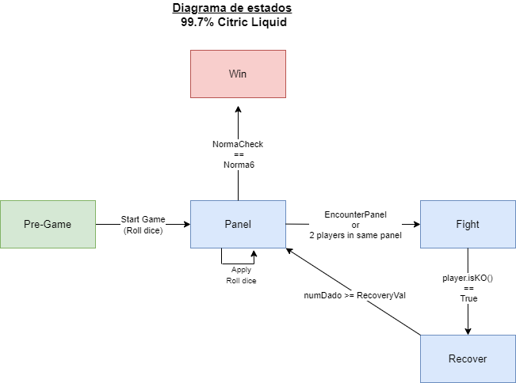

# 99.7% Citric Liquid

## About

`99.7% Citric Liquid` is a simplified clone of the renowned game, `100% Orange Juice`. Its main
purpose is to serve as an educational tool, teaching foundational programming concepts.

📢 **Note**: This project is purely educational and will not be used for any commercial purposes.

---

## For Students
--------------
Tarea 1
--------------
No hice README para la Tarea1.

--------------
Tarea 2
--------------
Bueno, en esta entrega se me complico bastante el tema del combate. Hice una variable para las unidades en general(WU o Player)
que se llama combatMode, el cual es un string que puede ser "EVA" o "DEF" para asi al momento de recibir un ataque se apliquen las reglas
de evasion o defensa. Este por defecto esta en modo defensa pero se puede cambiar (mi idea es que se cambie a futuro con el controlador).

Por otro lado, mis funciones de ataque/defensa/evasion no paran hasta que alguien de los de la pelea este derrotado, es ahi
donde entrego las estrellas usando algo similar a combatMode, hice un metodo que recibe las estrellas que se tienen que dar y un string
que indique si es un Wild Unit o un Plater, ya que un wild unit entrega todas sus estrellas y un jugador solo la mitad.

Sobre los paneles, en el Encounter Panel hice un metodo el cual aleatoriamente hace que spawnee un wild unit en el panel
el cual entra en combate con un jugador que este en el panel, para ello instancie un dado de 3 caras.

Sobre cambios con mi tarea1, separe la norma en distintas clases y cree un trait norma junto con una clase abstracta, lo
mismo para los paneles que no tenia clase abstracta y para las unidades cree traits wildunit y units ya que es mala practica
usar una clase abstracta como tipó y mis funciones en algun momento las usaron como tipo, con los traits me ahorro este problema.

## Diagrama de estados

--------------
Tarea 3
--------------
En esta ultima entrega tome algunas decisiones para mi codigo, por temas de tiempo creo que no cambiare el codigo de mi combate
pues es funcional.

Para hacer los estados me base en la foto que subieron al foro los auxiliares, en donde elimine el estado Wait, ya que, por 
como implemente mi combate no es necesario pues por como lo programe el combate no termina hasta que una de las dos unidades 
que estan combatiendo esten KO.

Acerca de lo nuevo, en el controlador cree un tablero por defecto para el juego, este tablero consta con los 5 tipos de paneles
en donde se repite 4 veces el HomePanel pues cada jugador debe tener el suyo propio (por enunciado, el juego consta de 4 jugadores). Es aqui donde decidi que cada jugador parte
en su HomePanel respectivo y a lo largo del juego se encontraran distintos paneles. 

No hice inputs, entonces al momento de hacer el Moving asumi que el player no iba a parar en su HomePanel
por lo que avanzara el numero de paneles que le salga al tirar su dado.

Para RecoverState no se si dejarlo asi ya que mi combate termina con un player ko y es mandado inmediatamente a recover,
sin embargo, deje el state ya que me sirve para ver si salio True o no en su intento de recuperarse

No pude hacer lo del observer, pero entregue documentado y con 90% de coverage.

    

This project is licensed under the [Creative Commons Attribution 4.0 International License](http://creativecommons.org/licenses/by/4.0/).

---